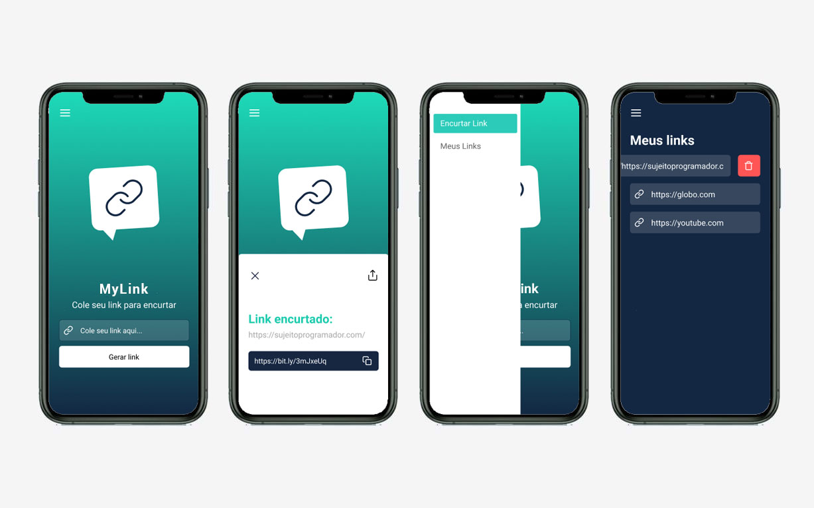

# MyLink

  

O MyLink é um encurtador de links. O usuário insere uma URL e o aplicativo gera um link encurtado do endereço inserido. Todos os links encurtados ficam armazenados no app para caso o usuário queira utilizá-los posteriormente. 

### Técnologias utilizadas:

* React Native 
* Expo

### Layout:

Você pode visualizar o layout do projeto através <a href="https://www.figma.com/file/wIHXXf1T62WkxJxt3VFze9/Insider-3.0?node-id=1%3A57">desse link</a>. É necessário ter conta no Figma para acessá-lo.